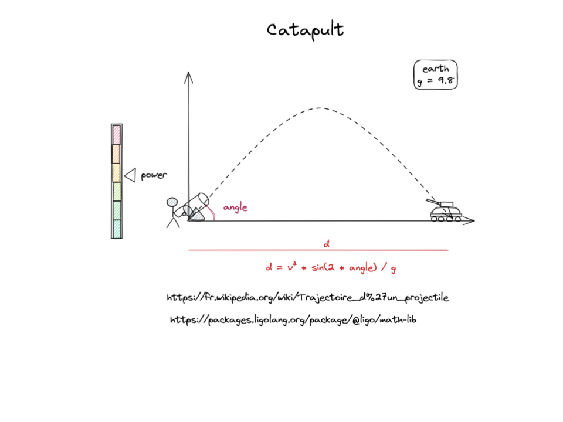
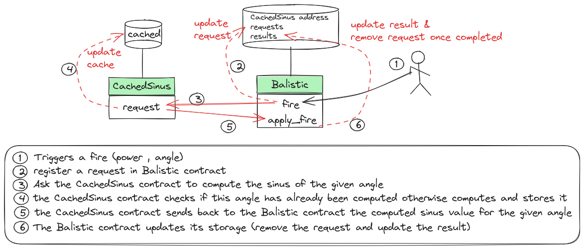

# QCM - rattrapage

Context: A hacker has found a breach in our security system and has deleted some lines in the source code of the Balistic project. 

Your mission: As an expert of LIGO, repare the source code by answering correctly to the questions in the following files:   

- 
- 
- 


+-----------+------------+
| questions | difficulty |  
+-----------+------------+
|    Q1     |   easy     |
|    Q2     |   easy     |
|    Q3     |   easy     |
|    Q4     |   easy     |
|    Q5     |   hard     |
|    Q6     |   easy     |
|    Q7     |   medium   |
|    Q8     |   medium   |
|    Q9     |   easy     |
|    Q10    |   easy     |
|    Q11    |   easy     |
|    Q12    |   easy     |
|    Q13    |   medium   |
|    Q14    |   medium   |
|    Q15    |   easy     |
|    Q16    |   easy     |
|    Q17    |   easy     |
|    Q18    |   easy     |


## Project

The Balistic project is designed to compute the distance of a balistic shot. It also aims to create a collective database of all sinuses computed. 



Concerning the baslistic trajectory the computation take only newtonian gravity into account (no wind, no electrical charges, no spin on the bullet, ...) to make simpliest as possible so the distance `d = v² * sin(2*a) / g` where `v` is the initial vector, `a` the angle, `g` gravity attraction from earth. 


## Contrats

- A contract `CachedSinus` that performs sinus computation (using the Math library), and stores the result in its storage. Think it as a memory for every one ! Once a sinus is computed, its value is remembered and thus will not be recomputed (the gas cost is smaller for the second call). 

- A contract `Balistic` that computes a balistic trajetory (takes only newtonian gravity into account). The sinus computation must be delegated to the `CachedSinus` contract. 
During a Fire entrypoint call, the contract CachedSinus may be modified (in case the given angle has never be computed). Because of this side-effect, communication between Balistic and CachedSinus is asynchronous and thus the `Fire` implementation must be separated into 2 part: the request of the `sinus(angle)` value and the computation of the balistic distance.





## Math library

It is not asked to recode the sinus function ! 
The `CachedSinus` contract can use a library `@ligo/math-lib` which introduces two concepts that are not natively supported by the LIGO language
- floating point numbers (aka type float)
- trigonometric functions (including `sin` function)

The library is distributed via the registry of ligolang web site  and the code of the library is available 

```
// A floating point number is represented as n = value * 10^pow
// So the float type is composed of two integers
type float = {
   value : int;
   pow : int
}
```

Check the `.ligo` directory for the `math-lib` source code.

